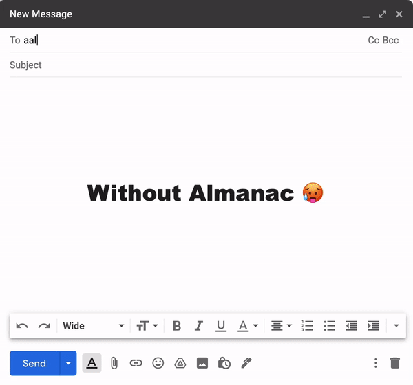

Almanac
=======
Picture this: it's midnight, you've got a group project due in 8 hours, and you need to email one of your classmates ASAP. The problem? You don't know their PennKey. Now, you could spend an hour stalking them on Instagram to get their last name, so that you could plug it into Canvas's People page, and then hope their email's public... but who wants to do that?

That's where Almanac comes in, a Python script that generates and uploads a Google Contacts-compatible address book for Penn email accounts. Take a look at the before and after:

  

Dependencies
------------
- All code is written in Python 3.
- Relies on the 'csv' library.
- Relies on the 'selenium' library.
- Requires installation of 'chromedriver', a separate executable used by Selenium.

Disclaimer
----------
To access the Penn Directory, this script will ask you to log-in to your Penn account. Your credentials are not stored at any point; think of it like just logging into your Penn account on a new browser. 

Similarly, to upload the created contacts to Google Contacts, this script will ask you to log-in to your Penn Gmail account. Your credentials are never stored or documented; this repository is open-source for a reason.

To ensure the privacy of users of Penn's network, this script is only usable by those with valid Penn accounts.

Setup
-----
- Clone this repository to your desired location.
- Install a compatible distribution of Python 3.
- `python3 -m pip install csv`
- `python3 -m pip install selenium`
- [Download](https://chromedriver.chromium.org/downloads "https://chromedriver.chromium.org/downloads") the version of chromedriver that matches your version of Google Chrome to the repository folder. The one included corresponds to Chrome version 93. If that doesn't correspond to your version of Chrome, replace it.
- Run 'almanac.py'.

Usage
-----
After logging in to Penn Directory, the script will prompt you to choose which organizations and affiliations you'd like to scrape contacts from. To create a contacts file of all undergraduate students, input `UNDER;COLLEGE OF ARTS & SCIENCES` when asked for your organizations of choice, and `STU` when asked for your affiliation of choice. For alternate configurations, see the Penn Directory's [documentation](https://directory.apps.upenn.edu/directory/jsp/fast.do "https://directory.apps.upenn.edu/directory/jsp/fast.do").

At the script's conclusion, you'll be asked to choose a CSV file to upload to Google Contacts. Navigate to the folder this script is contained in, and select the file titled 'contacts.csv'.
